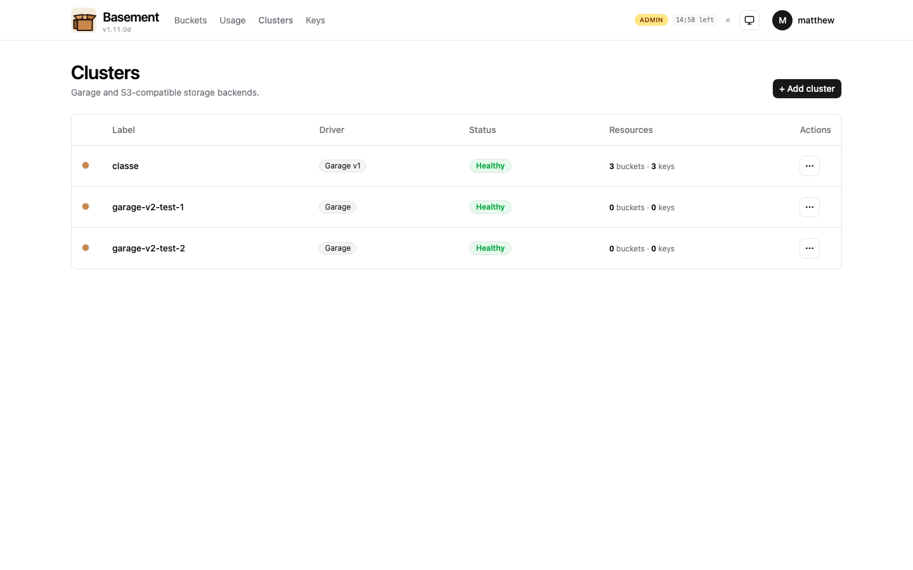
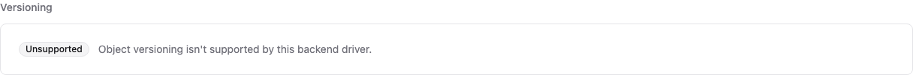
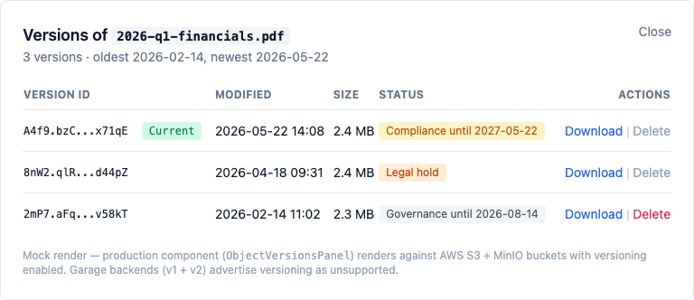
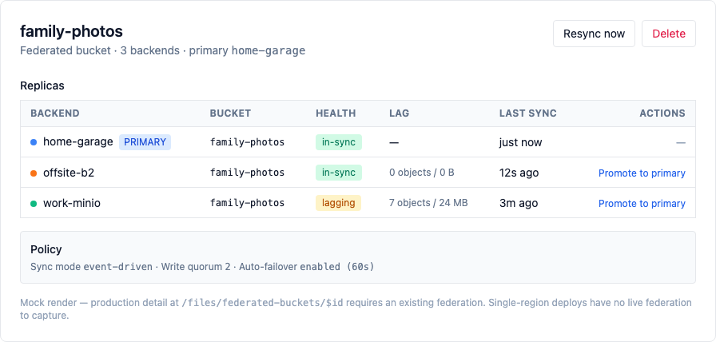
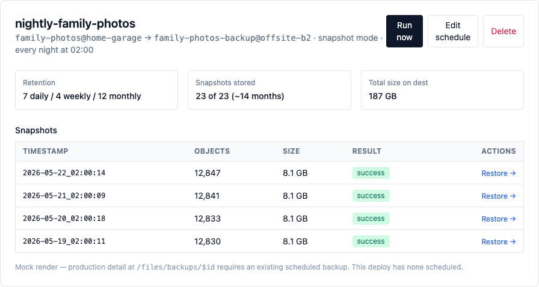
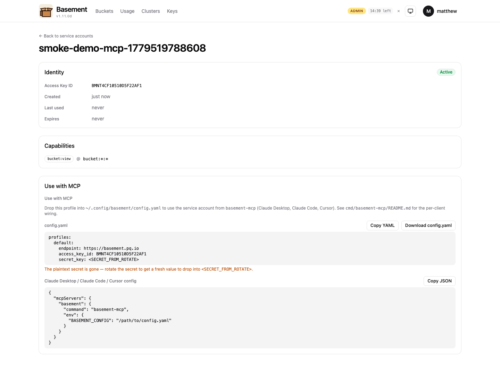
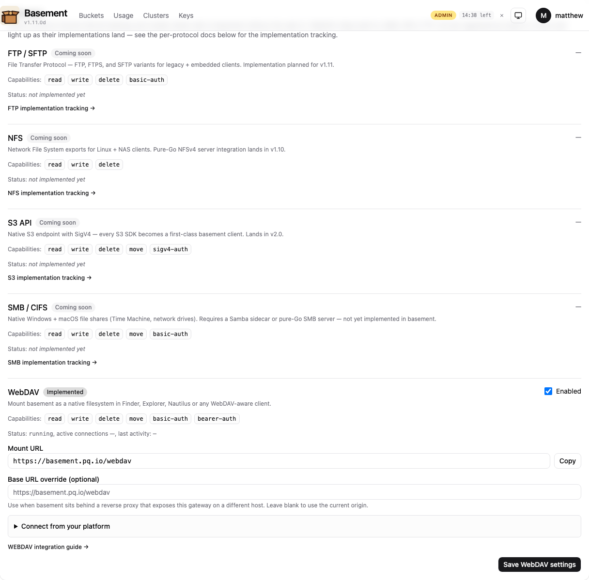
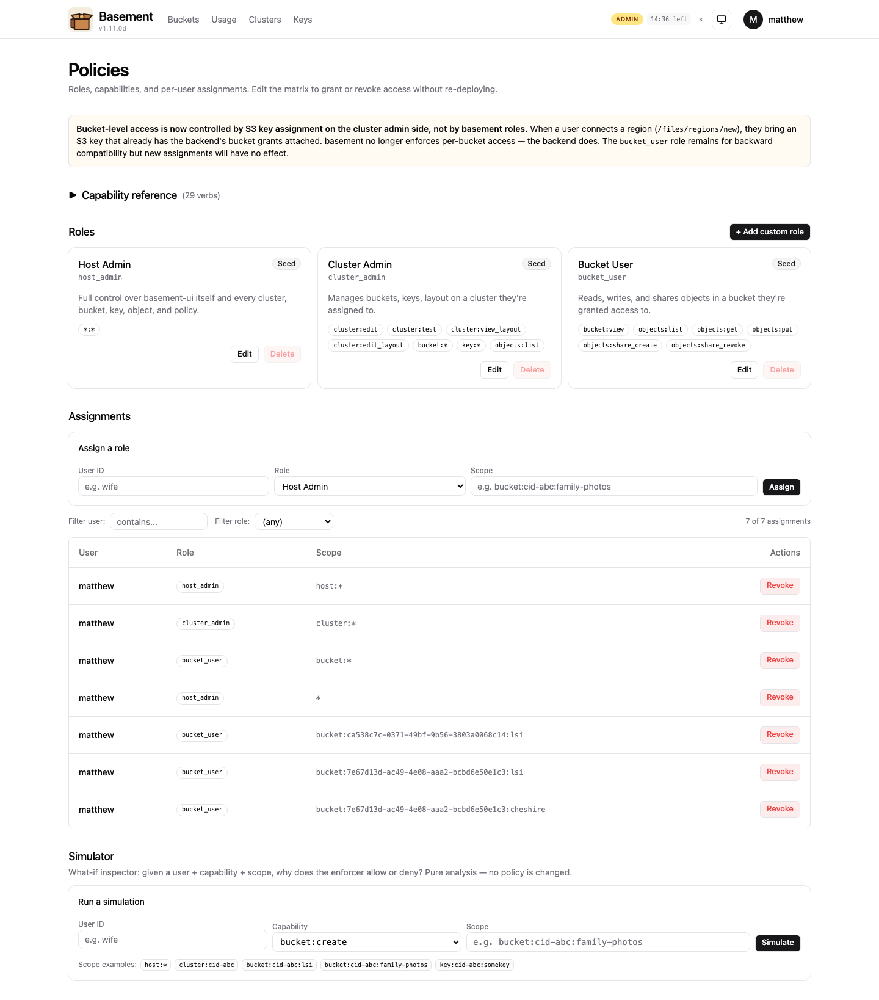

# basement

> One pane of glass for Garage, MinIO/OpenMaxIO, and AWS S3 —
> region-aware user persona, multi-backend admin underneath.

[![CI badge]] [![Release badge]] [![License: AGPL-3.0]]

## Why basement

The post-MinIO Console world (Feb 2026 archival) left self-hosters
without a polished, multi-backend admin UI: the replacements are
either single-backend (OpenMaxIO, garage-webui, garage-ui) or
alpha-quality with security issues (RustFS). basement is the
gap-filler — identity-aware admin for Garage v1, Garage v2, AWS S3,
and MinIO/OpenMaxIO behind one login, with a flexible policy matrix,
per-user encrypted credentials, and federation across backends so a
single bucket can live in lock-step on home Garage and an off-site
B2 copy. It's a single static Go binary with an embedded React app
that runs as a distroless container.

## Quickstart (5 minutes, evaluation)

```bash
docker run -d --name basement -p 8080:8080 \
  -v basement-data:/var/lib/basement \
  ghcr.io/mattjackson/basement:latest

# Wait ~5 seconds, then grab the auto-generated admin password:
docker logs basement 2>&1 | grep "INITIAL ADMIN PASSWORD"
# INITIAL ADMIN PASSWORD: <24-char string>

# Open http://localhost:8080, log in as admin / <password>,
# and add your first cluster from /admin/clusters.
```

No env vars, no bcrypt CLI, no JWT secret to generate up front —
basement auto-bootstraps both on first boot (v1.11.0c). See
[`docs/deployment/docker.md`](docs/deployment/docker.md) for what
gets persisted to disk and the production checklist (explicit
secrets, reverse-proxy, TLS, backups).

Prefer a guided one-liner that pulls the image, drops a
`docker-compose.yml` alongside it, and prints the password for you?

```bash
curl -sSL https://raw.githubusercontent.com/MattJackson/basement/main/scripts/install.sh | bash
```

(Review-before-run recommended:
`curl -sSLo install.sh https://.../install.sh && less install.sh && bash install.sh`.)

## Screenshots

A representative slice of the v1.10 UI surface (full 15-shot gallery
at [`docs/screenshots/v1.10/`](docs/screenshots/v1.10/),
index at [`docs/screenshots/README.md`](docs/screenshots/README.md)):

| | |
|---|---|
| **Multi-cluster admin** at `/admin/clusters` <br/>  | **Per-bucket settings honest about driver capabilities** (Garage shown — versioning unsupported) <br/>  |
| **Per-version actions** — retention + legal hold + per-version delete <br/>  | **Federation detail** — replica health, manual + auto failover <br/>  |
| **Scheduled backups + snapshot history** with one-click restore <br/>  | **MCP service-account config** — ready-to-paste YAML + Claude / Cursor JSON <br/>  |
| **Registry-driven Gateways card** at `/admin/system` <br/>  | **Policy matrix + simulator** at `/admin/policies` <br/>  |

Shots ending in `-mocked.png` are static-HTML renders for components
that can't be exercised on a Garage-only deploy (e.g. the live target
doesn't support versioning, federation, or scheduled backups in
this configuration). Each mocked shot embeds an explicit disclaimer
naming the production component. See
[`docs/screenshots/README.md`](docs/screenshots/README.md) for the
full index, per-shot notes, and the re-capture command.

## Features

| Area | Highlights | Shipped in |
|------|------------|-----------|
| Backends | Garage v1, Garage v2 (first UI for the v2 admin API), AWS S3, MinIO / OpenMaxIO; capability-flag UI gating (no driver-name checks) | v0.5 → v1.x |
| Multi-cluster admin | Add N clusters, manage them side by side; cross-cluster bucket list; cluster-to-cluster migrate wizard; driver-aware form hints | v0.5 → v1.3 |
| Auth | OIDC + local password; OIDC group → role auto-mapping; bcrypt + JWT in `__Host-` cookie | v0.5 → v1.3 |
| Roles | Three-tier model (Host Admin / Cluster Admin / User), orthogonal axes; sudo-style admin elevation (USER → ADMIN with re-auth + operator-configurable TTL) | [ADR-0001](docs/adr/0001-rbac-three-tier-creds.md), [ADR-0003](docs/adr/0003-sudo-style-admin-elevation.md) — v1.2 / v1.3 |
| Policy matrix | 27 capabilities × roles × scopes; "what-if" simulator at `/admin/policies`; persistent invite tokens for onboarding | v0.9 / v1.3 |
| User keychain | Region-tier ([ADR-0002](docs/adr/0002-region-tier-user-model.md)); multiple AES-GCM-encrypted keys per endpoint; rotate-in-place; per-region S3 addressing toggle (path-style / virtual-host) | v1.1 → v1.3 |
| Bucket browser | Virtualized for 10K+ rows; folder navigation; batch operations with sticky action bar; mobile card layout below 640px; federation badge | v1.3 / v1.4 / v1.6 / v1.8 |
| Backups | Scheduled S3 → S3; mirror + snapshot modes; GFS retention with auto-prune; 3-step restore wizard with snapshot deep-link | v1.5 |
| Federation | `FederatedBucket` across N backends; event-driven replication (in-process pub/sub, polling fallback); manual + auto failover; 5-step wizard | v1.6 / v1.7, [ADR-0005](docs/adr/0005-federation.md) |
| M2M auth | `BMNT`-prefixed service-account bearer credentials scoped per-capability; HMAC-signed bucket webhooks with auto-disable | v1.7 |
| AI agents | `basement-mcp` stdio server (ten tools at launch — seven read + two write + one placeholder); per-SA "Use with MCP" YAML + Claude / Cursor JSON snippet | v1.8 |
| Mobile / PWA | Installable PWA (vite-plugin-pwa, iOS standalone hooks, theme color, offline-cached app shell); install-to-home-screen banner | v1.8 |
| Gateways | Pluggable `Gateway` + `Backend` + `Registry` interfaces (`internal/gateway/`); WebDAV implementation; SMB / NFS / FTP / S3 stubs surface in `/admin/system → Gateways` from day one | v1.9 |
| Compliance + integrity | Per-bucket versioning; Object Lock (Governance + Compliance + per-version legal hold); default SSE-S3 + SSE-KMS; AWS S3 + MinIO full, Garage advertises unsupported (content-addressed block store) | v1.10 |
| Operability | Per-cluster usage growth analytics + anomaly banner; paginated audit log with CSV export; Garage block-scrub UI; layout editor (Garage); first-run onboarding wizard (v1.11); auto-bootstrap JWT + admin password (v1.11) | v1.4 / v1.11 |

Per-release write-ups under [`docs/release-notes/`](docs/release-notes/)
(v1.0 through v1.11). All releases ship as a single static Go
binary plus an embedded React app inside the `ghcr.io/mattjackson/basement`
distroless container, running as UID 65532.

## Comparison vs other OSS admin UIs

| Feature                              | basement v1.11 | khairul169/garage-webui | Noooste/garage-ui | OpenMaxIO       |
|--------------------------------------|------------------|-------------------------|-------------------|-----------------|
| Garage admin                         | yes (v1 + v2)    | yes                     | yes               | no              |
| MinIO admin                          | yes              | no                      | no                | yes (MinIO-only)|
| AWS S3 admin                         | yes (driver)     | no                      | no                | no              |
| Multi-cluster from one UI            | yes              | no                      | no                | no              |
| OIDC / SSO                           | yes              | no                      | yes               | (MinIO-driven)  |
| Flexible role/permission matrix      | yes (27 caps)    | no                      | yes (teams)       | (MinIO-driven)  |
| Per-user encrypted S3 credentials    | yes (region-keyed) | no                    | no                | no              |
| Cross-backend sync (Migrate wizard)  | yes              | no                      | no                | no              |
| Scheduled backups + GFS retention    | yes (v1.5)       | no                      | no                | no              |
| Point-in-time restore wizard         | yes (v1.5)       | no                      | no                | no              |
| Multi-backend federation + failover  | yes (v1.6)       | no                      | no                | no              |
| M2M service accounts (bearer auth)   | yes (v1.7)       | no                      | no                | (MinIO-driven)  |
| HMAC-signed bucket webhooks          | yes (v1.7)       | no                      | no                | (MinIO-driven)  |
| Event-driven federation replication  | yes (v1.7)       | no                      | no                | no              |
| MCP server for AI agents             | yes (v1.8)       | no                      | no                | no              |
| Installable mobile PWA               | yes (v1.8)       | no                      | no                | no              |
| WebDAV gateway (native FS mount)     | yes (v1.9)       | no                      | no                | no              |
| Pluggable gateway architecture       | yes (v1.9)       | no                      | no                | no              |
| Bucket versioning UI                 | yes (v1.10)      | no                      | no                | yes (MinIO-only)|
| Object Lock UI (Governance/Compliance/Legal hold) | yes (v1.10) | no             | no                | yes (MinIO-only)|
| Default SSE-S3 + SSE-KMS UI          | yes (v1.10)      | no                      | no                | yes (MinIO-only)|
| Bucket lifecycle wizard              | yes              | no                      | no                | (MinIO-driven)  |
| Policy simulator (what-if)           | yes              | no                      | no                | no              |
| Delete protection (two-phase)        | yes              | no                      | no                | no              |
| Layout editor                        | yes (Garage)     | yes                     | yes               | n/a             |
| Open source license                  | AGPL-3.0         | AGPL                    | MIT               | AGPL (fork)     |

With v1.11 shipped, basement matches MinIO Console feature-for-feature
on the security / integrity axis (versioning, object lock, SSE) while
remaining the only multi-backend UI in the table — and on the
operability + onboarding axis (first-run wizard, 5-min install,
Prometheus + Grafana, production deployment guide, SECURITY +
CONTRIBUTING + SBOM) v1.11 closes the launch-readiness gap that
made earlier minors a self-hoster's project rather than a drop-in
control plane.

## What's next

**v1.x is complete.** v1.11 (shipped) is the launch-readiness
milestone — first-run onboarding wizard, production deployment
guide, 5-minute install, trust + credibility docs (SECURITY,
CONTRIBUTING, DCO, SBOM workflow), Garage v2 driver in admin-tier,
observability (Prometheus + Grafana + alert rules + slog), and the
screenshots gallery + README polish. basement is now genuinely
consumable by external operators without insider knowledge. See
[`docs/release-notes/v1.11.0.md`](docs/release-notes/v1.11.0.md).

**v2.0 — basement IS a backend (S3 gateway)** is the next major
when external demand surfaces. Inbound S3 requests terminated and
SigV4-verified by basement; routed via the v1.6 federation topology
(read → nearest healthy replica; write → primary). v1.9's `Backend`
interface is already S3-shaped, so the gateway implementation slots
in alongside WebDAV without architecture churn. v1.10 versioning +
object-lock + SSE primitives gate the per-object write path.
ADR-0006 sketches the design.

The **v2.x line** carries the long-haul roadmap the v1.10 → v2.0
boundary unlocks: client-side encryption (E2EE) for untrusted-backend
federation replicas (v2.1); search + tags + smart collections (v2.2);
SMB + NFS gateways alongside WebDAV (v2.3); cost engine + cross-
backend lifecycle (v2.4); plugin SDK + multi-site mesh + IPFS / CDN
+ marketplace (v3.0). See [ADR-0004](docs/adr/0004-v2-scoping-proposal.md) and
[ADR-0005](docs/adr/0005-federation.md) for the design lineage.

## Architecture

- **Backend**: Go 1.23+, chi router, embedded JSON store
- **Frontend**: React 19 + TanStack Router/Query + shadcn/ui + Tailwind 4
- **Auth**: bcrypt + JWT in `__Host-` cookie (SameSite=Strict) + OIDC (coreos/go-oidc); service-account bearer auth alongside the cookie
- **Drivers**: Go interface; per-backend translation layer; capability flags drive UI gating (no driver-name checks)
- **Gateways**: `internal/gateway/{Gateway,Backend,Registry}` — WebDAV implemented; SMB / NFS / FTP / S3 register as stubs at boot
- **Policy enforcer**: `internal/auth/policy/` — capability registry (compiled-in), Role + RoleAssignment store, `Can(user, capability, scope)` primitive plus `CanWithReason()` for the simulator
- **Per-user region keychain**: `internal/store/user_regions.go` — AES-GCM encrypted secrets, keyed off JWT signing secret; one record per (user, endpoint, alias); per-request signing via `Registry.ForUserRegion(...)`
- **Persistence**: JSON files under `BASEMENT_DATA_DIR` (default `/var/lib/basement`); atomic write via tmp+fsync+rename
- **Design contracts**:
  - [`docs/adr/0001-rbac-three-tier-creds.md`](docs/adr/0001-rbac-three-tier-creds.md) — role / capability / scope model
  - [`docs/adr/0002-region-tier-user-model.md`](docs/adr/0002-region-tier-user-model.md) — region tier at the user persona
  - [`docs/adr/0003-sudo-style-admin-elevation.md`](docs/adr/0003-sudo-style-admin-elevation.md) — USER → ADMIN state machine (v1.2 / v1.3)
  - [`docs/adr/0005-federation.md`](docs/adr/0005-federation.md) — multi-backend federation
  - [`docs/adr/0006-v2-s3-gateway.md`](docs/adr/0006-v2-s3-gateway.md) — v2.0 S3 gateway design (proposal)

See [`docs/configuration.md`](docs/configuration.md) for the env
reference and [`docs/deployment/`](docs/deployment/) for production
posture (Docker, reverse-proxy, TLS, hardening, backup-and-restore,
upgrades).

## Contributing

PRs welcome. Driver authors especially — basement is designed to
accept new backends. See [`CONTRIBUTING.md`](CONTRIBUTING.md) (DCO,
sign-offs, dev loop) and [`docs/integrations/adding-a-gateway.md`](docs/integrations/adding-a-gateway.md)
for the gateway tier.

Security reports: [`SECURITY.md`](SECURITY.md).

## License

GNU Affero General Public License v3.0 (AGPLv3). See [LICENSE](./LICENSE).

For commercial licensing (proprietary embedding, hosted SaaS,
modifying without publishing source): contact matthew@pq.io.
