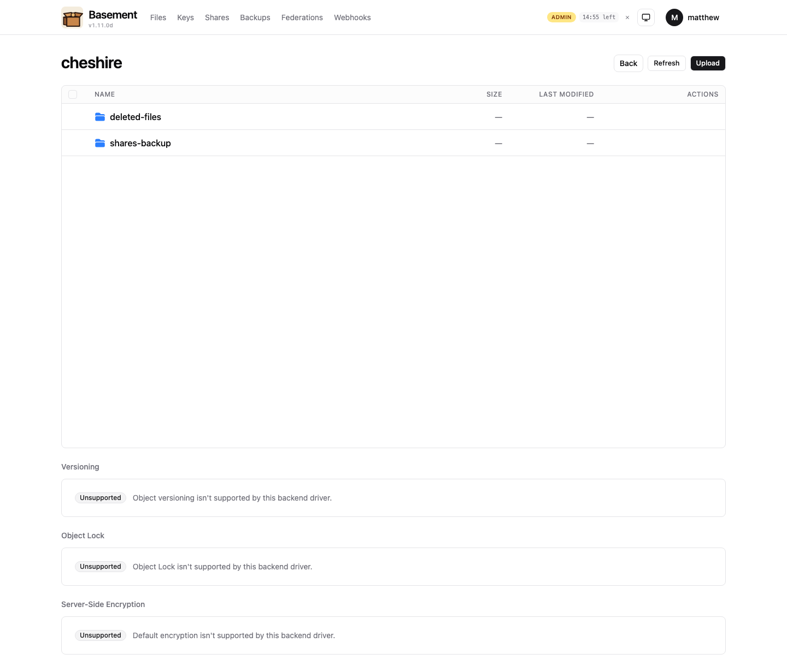

# basement

[](https://github.com/MattJackson/basement/releases)
[](https://www.gnu.org/licenses/agpl-3.0)
[](https://github.com/MattJackson/basement/blob/main/go.mod)
[](https://github.com/MattJackson/basement/pkgs/container/basement)
[](https://github.com/MattJackson/basement/actions/workflows/sbom.yml)

> One pane of glass for self-hosted S3-compatible object storage.
> Manage many backends from one UI. Mount as a network drive.
> Drive it from Claude via MCP. AGPLv3.


## What it does

- **Multi-backend admin** — connect Garage (v1 + v2), AWS S3, and other S3-compatible backends and manage them side by side from one login. Capability flags (not driver-name checks) gate every per-backend feature in the UI.
- **Identity-aware** — OIDC SSO (Authentik, Pocket-ID, Keycloak and other compliant providers) plus local password; group-claim → role auto-mapping; a three-axis RBAC model (UI Admin / Cluster Admin / User) with sudo-style admin elevation (re-auth + operator-configurable TTL).
- **Per-user encrypted keychain** — region-scoped S3 credentials encrypted at rest with AES-GCM; rotate-in-place; per-region path-style / virtual-host toggle.
- **Federation** — a logical bucket can live on multiple backends with event-driven replication, manual + automatic failover, and a 5-step wizard.
- **Backups** — scheduled S3 → S3 with mirror or snapshot modes, GFS retention with auto-prune, and a 3-step point-in-time restore wizard.
- **Access surfaces** — web UI, WebDAV gateway (native Finder / Explorer / Files-app mounts, Time Machine), MCP server for AI agents (Claude / Cursor), and service-account bearer tokens for machine-to-machine.
- **Observability** — Prometheus `/metrics`, structured slog, a Grafana dashboard and alert rules ship in the box under [`docs/observability/`](docs/observability/).
- **Compliance + integrity** — per-bucket versioning, S3 Object Lock (Governance + Compliance + per-version Legal Hold), and default SSE-S3 + SSE-KMS encryption surfaced in the bucket settings.
- **Pluggable gateways** — `Gateway` + `Backend` + `Registry` interfaces in [`internal/gateway/`](internal/gateway/); WebDAV ships as the reference implementation, with SMB / NFS / FTP / S3 surface points registered.
- **Mobile PWA** — installable on iOS and Android home screens; touch-friendly bucket browser below 640px.

Per-backend capability varies — Garage, AWS S3, and other drivers each advertise their own feature set; the UI honours that and never offers a control the backend can't fulfil.

## Quickstart (5 minutes)

```bash
docker run -d --name basement -p 8080:8080 \
  -v basement-data:/var/lib/basement \
  ghcr.io/mattjackson/basement:latest

# Wait ~5 seconds, then grab the auto-generated admin password:
docker logs basement 2>&1 | grep "INITIAL ADMIN PASSWORD"
# INITIAL ADMIN PASSWORD: <24-char string>

# Open http://localhost:8080 and complete the first-run wizard.
```

No env vars, no bcrypt CLI, no JWT secret to generate up front — basement auto-bootstraps both on first boot and walks you through cluster, admin, and policy setup in the browser.

Prefer a guided one-liner that drops a `docker-compose.yml` alongside the container and prints the password for you?

```bash
curl -sSL https://raw.githubusercontent.com/MattJackson/basement/main/scripts/install.sh | bash
```

(Review-before-run recommended: `curl -sSLo install.sh https://.../install.sh && less install.sh && bash install.sh`.)

For production — TLS, reverse proxy (Caddy / Nginx / Traefik), hardening, backup-and-restore, in-place upgrades — see the [deployment guide](docs/deployment/).

## Screenshots

A representative slice of the UI (full 15-shot gallery in [`docs/screenshots/v1.10/`](docs/screenshots/v1.10/), index in [`docs/screenshots/README.md`](docs/screenshots/README.md)):

| | |
|---|---|
| **Multi-cluster admin** at `/admin/clusters` <br/>  | **Bucket browser** — virtualized for 10K+ rows, folder navigation, batch actions <br/>  |
| **Per-bucket settings honest about driver capabilities** <br/>  | **Per-object version actions** — retention + legal hold + per-version delete <br/>  |
| **Federation detail** — replica health, manual + auto failover <br/>  | **Scheduled backups + snapshot history** with one-click restore <br/>  |
| **MCP service-account config** — ready-to-paste Claude / Cursor JSON <br/>  | **Policy matrix + simulator** at `/admin/policies` <br/>  |

Shots ending in `-mocked.png` are Playwright-driven static-HTML renders for components that can't be exercised on every deploy (e.g. versioning, federation, or scheduled backups against a backend that doesn't support them). Each mocked shot embeds an explicit disclaimer. See [`docs/screenshots/README.md`](docs/screenshots/README.md) for the full index, per-shot notes, and the re-capture command.

## Roadmap

**v1.x is complete.** The v1 line built basement from a single-cluster admin surface into a multi-backend control plane with federation, backups, M2M auth, MCP, mobile PWA, gateways, compliance primitives, and launch-readiness onboarding.

| Minor | Headline |
|------|---------|
| v1.0 | RBAC + audit log + metrics persistence |
| v1.1 | Region-tier user persona ([ADR-0002](docs/adr/0002-region-tier-user-model.md)) |
| v1.2 | Sudo-style admin elevation ([ADR-0003](docs/adr/0003-sudo-style-admin-elevation.md)) |
| v1.3 | OIDC + key-first user model + per-region addressing |
| v1.4 | Scale + perf — virtualized browser, paginated audit, Garage block-scrub |
| v1.5 | Scheduled backups + GFS retention + point-in-time restore |
| v1.6 | Federation + multi-backend replication ([ADR-0005](docs/adr/0005-federation.md)) |
| v1.7 | Service accounts + webhooks + event-driven federation |
| v1.8 | MCP server + mobile PWA + service-account config UX |
| v1.9 | WebDAV gateway + pluggable gateway architecture |
| v1.10 | Bucket versioning + Object Lock + SSE-S3 / SSE-KMS |
| v1.11 | Launch readiness — first-run wizard, 5-min install, observability, deployment guide |

**v2.0 — basement IS a backend (S3 gateway).** Inbound S3 requests terminated and SigV4-verified by basement, then routed through the v1.6 federation topology (read → nearest healthy replica; write → primary). v1.9's `Backend` interface is already S3-shaped, so the gateway implementation slots in alongside WebDAV without architecture churn. v1.10 versioning + object-lock + SSE primitives gate the per-object write path. See [ADR-0006](docs/adr/0006-v2-s3-gateway.md).

**v2.x line** carries the long-haul roadmap: client-side end-to-end encryption for untrusted-backend federation replicas (v2.1); search + tags + smart collections (v2.2); SMB + NFS gateways alongside WebDAV (v2.3); cost engine + cross-backend lifecycle (v2.4); plugin SDK + multi-site mesh + IPFS / CDN + marketplace (v3.0). See [ADR-0004](docs/adr/0004-v2-scoping-proposal.md) and [ADR-0005](docs/adr/0005-federation.md) for design lineage.

## Architecture

- **Backend** — Go 1.25, chi router, embedded JSON store; single static binary in a distroless container running as UID 65532.
- **Frontend** — React 19, TanStack Router + Query, shadcn/ui, Tailwind 4; embedded in the binary.
- **Auth** — bcrypt + JWT in a `__Host-` cookie (`SameSite=Strict`) + OIDC (`coreos/go-oidc`); service-account bearer tokens alongside the cookie.
- **Drivers** — Go interface with per-backend translation; capability flags drive UI gating, never driver-name checks.
- **Gateways** — [`internal/gateway/{Gateway,Backend,Registry}`](internal/gateway/) — WebDAV implemented; SMB / NFS / FTP / S3 register as stubs at boot.
- **Policy enforcer** — [`internal/auth/policy/`](internal/auth/policy/) — capability registry (compiled-in), Role + RoleAssignment store, `Can(user, capability, scope)` plus `CanWithReason()` for the simulator.
- **Per-user region keychain** — AES-GCM encrypted secrets keyed off the JWT signing secret; one record per (user, endpoint, alias); per-request signing via `Registry.ForUserRegion(...)`.
- **Persistence** — JSON files under `BASEMENT_DATA_DIR` (default `/var/lib/basement`); atomic write via tmp + fsync + rename.

## Documentation

- [Deployment](docs/deployment/) — Docker, reverse proxy, TLS, hardening, backups, upgrades
- [Observability](docs/observability/) — Prometheus alerts, Grafana dashboard, slog config
- [Integrations](docs/integrations/) — WebDAV, Time Machine, SMB / NFS / FTP / S3 gateways
- [Configuration reference](docs/configuration.md) — every env var, every flag
- [Architecture decision records](docs/adr/) — design history (RBAC, region tier, sudo elevation, federation, S3 gateway)
- [Release notes](docs/release-notes/) — per-minor write-ups, v1.0 through v1.11
- [Screenshots](docs/screenshots/) — gallery + capture scripts
- [Security policy](SECURITY.md) — threat model, supported versions, disclosure
- [Contributing](CONTRIBUTING.md) — DCO sign-off, dev loop, driver author guide
- [Changelog](CHANGELOG.md)

## Contributing

PRs welcome. Driver authors and gateway authors especially — basement is built to accept new backends and new access surfaces. Start at [`CONTRIBUTING.md`](CONTRIBUTING.md) for the dev loop and DCO sign-off, and [`docs/integrations/adding-a-gateway.md`](docs/integrations/adding-a-gateway.md) for the gateway tier.

Security reports: [`SECURITY.md`](SECURITY.md).

## License

GNU Affero General Public License v3.0 — see [LICENSE](./LICENSE).

For commercial dual-licensing (proprietary embedding, hosted SaaS without source disclosure, modifying without publishing changes): contact matthew@pq.io.
